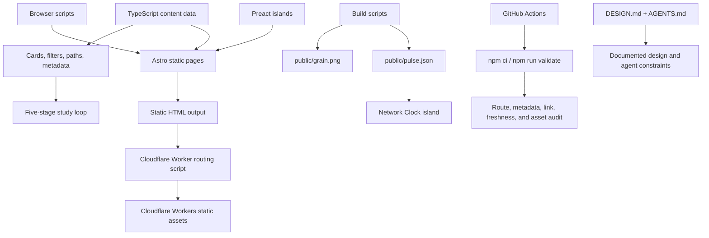

# BitcoinMind

BitcoinMind is a static-first, first-principles study site for understanding Bitcoin as money, protocol, verification practice, custody, and a contested institution.

Live site: https://bitcoinmind.com

The site is not a price tracker, trading dashboard, news feed, or generic crypto portal. It is a curated learning map: a structured place to read, compare ideas, follow study paths, inspect long-term frames, and connect practical tools with monetary and protocol-level concepts.

## Purpose

Bitcoin information is easy to collect and hard to sequence. New readers often encounter price commentary, ideology, technical fragments, and scattered resource lists before they understand the basic order of ideas.

BitcoinMind organizes the subject around a few recurring questions:

- What problem does money solve?
- How can Bitcoin's rules hold without a central operator?
- Which claims can a reader verify independently?
- Which risks move to the holder in self-custody?
- Which conclusions remain uncertain or contestable?

The project favors curation over volume. A resource belongs in the site only if it improves the learning path.

## Core Sections

Current public sections include:

- **Primer** — a five-step entrance through money, protocol mechanics, verification, custody, and objections.
- **Paths** — guided routes through orientation, understanding, verification, practice, and reflection.
- **Library** — a selective book shelf organized by learning role rather than popularity.
- **Texts** — primary sources, influential essays, and technical references.
- **Toolkit** — a reviewed set of node, wallet, custody, payment, and network-observation tools.
- **Frames** — interactive conceptual views for understanding monetary hardness and purchasing power.
- **Timeline** — digital-cash precursors and major protocol, custody, market, and policy milestones.
- **Glossary** — bounded definitions that state what a term does and does not prove.
- **Objections** — serious criticisms answered by first stating what each criticism gets right.
- **Stack** — the site owner's custody principles, failure modes, recovery, and inheritance practice.
- **Notes** — personal writing and source notes, including the April 2011 Bitcoin note.
- **Questions** — reader-style questions answered from the site's point of view.
- **About** — origin story and curation principles.

## Architecture



## Technical Stack

The repository currently uses:

- Astro 7
- `@astrojs/preact` 6
- Preact 10 islands
- TypeScript 5
- CSS custom properties for the design system
- Fontsource packages for Literata, Inter, and Geist Mono
- GitHub Actions CI
- Cloudflare Workers static assets via Wrangler with a small Worker routing script

The dependency source of truth is `package.json`. Deployment details are in `astro.config.mjs`, `wrangler.jsonc`, `worker/index.js`, and `public/_headers`.

Local and CI builds require Node.js 22.12 or newer. Astro 7 uses Vite 8 and its Rust-based compiler/bundling pipeline; the project does not depend on custom Vite plugins or legacy Markdown processors.

## Project Structure

```text
src/
  components/       Astro and Preact UI components
  data/             Curated content and chart datasets
  layouts/          Shared document shell and metadata layout
  lib/              SEO helpers, site metadata, generated values
  pages/            Static routes
  scripts/          Browser interaction scripts
  styles/           Design tokens and global styles

scripts-build/      Data refresh and generated asset scripts
public/             Static files, generated pulse snapshot, headers
.github/workflows/  CI workflow
```

Important files:

```text
README.md                    Project overview and development notes
DESIGN.md                    Design system and editorial constraints
AGENTS.md                    Rules for AI coding agents and scripted edits
src/styles/design-system.css Design tokens
src/styles/styles.css        Global component/page styling
src/layouts/Base.astro       Shared page shell and metadata
src/components/Nav.astro     Main navigation
src/lib/seo.ts               SEO metadata helpers
worker/index.js              Canonical host and legacy sitemap redirects before static assets
```

## Content Model

Most curated resources live in TypeScript data files under `src/data/`. These files are used by pages, cards, filters, paths, counts, and metadata.

This avoids duplicating the same resource descriptions across multiple pages. When adding or editing content, prefer updating the relevant dataset instead of hardcoding a copy directly inside an Astro page.

Typical content files include:

```text
src/data/library.ts
src/data/texts.ts
src/data/toolkit.ts
src/data/rabbit-holes.ts
src/data/timeline.ts
src/data/glossary.ts
src/data/debates.ts
src/data/questions.ts
src/data/frame-one.ts
src/data/frame-two.ts
```

## Design System

The visual system is intentionally quiet and editorial:

- warm dark background
- restrained cream text
- muted secondary copy
- sparse amber accents
- serif-led headings
- readable long-form spacing
- thin borders and low-noise surfaces

Design tokens live in:

```text
src/styles/design-system.css
```

Design rules and product-level visual constraints live in:

```text
DESIGN.md
```

Use existing tokens before adding new values. Avoid hardcoded colors, one-off page styles, or visual changes that make the site feel like a trading app, SaaS landing page, or crypto news product.

## Interactivity

The site is static-first. Client-side code is used only where it adds clear value.

Examples:

- Network Clock / pulse display
- interactive Frames
- resource filtering and empty states

Keep new interactive behavior small, accessible, and scoped to the relevant component or page. Do not convert static content pages into a broad client-side application unless there is a clear reason.

## Learning and Evidence Model

The study system uses one shared sequence across Primer, Library, Texts, Toolkit, and Paths:

```text
Orient -> Understand -> Verify -> Practice -> Reflect
```

Guided paths state a prerequisite, expected outcome, and next step. Internal path entries reference the canonical resource datasets by ID instead of duplicating titles and links.

The sequence is question-led rather than conversion-led. Protocol facts, editorial inferences, personal practices, and forecasts should remain visibly distinct. Claims are narrowed when evidence does not support certainty; unresolved questions stay unresolved.

Time-sensitive Toolkit entries include a review date and source label. Objections expose representative critical, technical, and contextual sources. Frames and generated network data identify their source or snapshot context. These fields are editorial review signals, not claims that a resource or recommendation is permanently current.

## Build-Time Data Refresh

`npm run refresh-data` updates generated assets and data used by the site:

- latest block-height fallback
- `public/pulse.json` network snapshot
- `public/grain.png` texture asset

The refresh path should be defensive. If a live source fails, the site should preserve a cached or fallback value rather than fail unnecessarily.

## Development

Install dependencies:

```bash
npm ci
```

Start the development server:

```bash
npm run dev
```

Run type and Astro checks:

```bash
npm run check
```

Audit the built site after `npm run build`:

```bash
npm run audit
```

Run the complete local and CI validation sequence:

```bash
npm run validate
```

Build the site:

```bash
npm run build
```

Refresh generated data:

```bash
npm run refresh-data
```

Preview the production build:

```bash
npm run preview
```

### Google Analytics 4

GA4 is wired into every page through the shared layout. The production web-stream Measurement ID is part of the public site configuration; forks or alternate environments can override it at build time:

```bash
cp .env.example .env
# Change PUBLIC_GA4_MEASUREMENT_ID in .env when using another GA4 property.
npm run build
```

The Google tag loads immediately on every page. Analytics storage is granted by default, while advertising storage, advertising user data, advertising personalization, and Google Signals remain disabled. With Enhanced Measurement enabled in the GA4 web stream, page views, scroll depth, outbound resource clicks, and file downloads are collected without additional page code. Resource-filter selections are sent as the recommended `select_content` event; free-form search terms are not sent.

## Working With AI Agents

This repository includes two guidance files for AI-assisted maintenance:

```text
DESIGN.md   Design, tone, visual identity, and editorial constraints
AGENTS.md   Execution rules, file boundaries, validation, and high-risk areas
```

Before making automated or AI-assisted changes, read both files. Keep diffs coherent, respect the existing information architecture, and validate with `npm run validate` when source code changes.

If documentation conflicts with the current codebase, treat the codebase source files as authoritative, then update the documentation so the mismatch does not persist.

## CI and Deployment

GitHub Actions runs validation on pull requests and pushes to `main`:

```text
npm ci
npm run validate
```

The audit runs against the generated `dist` output. It checks the sitemap route set, document metadata, one-H1 structure, internal routes and fragments, duplicate IDs, selected interactive/accessibility contracts, generated-data freshness, and static asset budgets. Playwright then checks the mobile menu, resource filtering, and the Frame 2 no-JavaScript experience in Chrome. Freshness fallback states are reported as warnings so a temporary upstream outage does not make a static build unavailable.

The production build outputs static assets from Astro. Cloudflare deployment is configured through Wrangler using the `dist` directory as the static assets source. `worker/index.js` runs before assets to redirect `www.bitcoinmind.com` to the apex domain and route legacy sitemap asset paths to the canonical sitemap.

## Maintenance Principles

- Keep the site static-first unless interactivity is clearly useful.
- Add content through typed datasets when possible.
- Preserve route stability and canonical metadata.
- Keep the visual system restrained and editorial.
- Prefer small coherent changes over broad rewrites.
- Update `DESIGN.md` and `AGENTS.md` when project rules or architecture change.
- Treat `package.json`, `astro.config.mjs`, `wrangler.jsonc`, and `src/pages/**` as the source of truth for current stack and routes.

## Current Limitations

BitcoinMind is currently a curated static learning site with selective interactive components. It does not include:

- user accounts
- personalization
- runtime LLM calls
- retrieval-augmented generation
- automated content evaluation
- citation-grounded AI answers

Any future AI feature should stay within the site's curated knowledge boundary, cite sources, admit uncertainty, and avoid becoming a generic chatbot.

## Author

BitcoinMind is built by Hiei.
