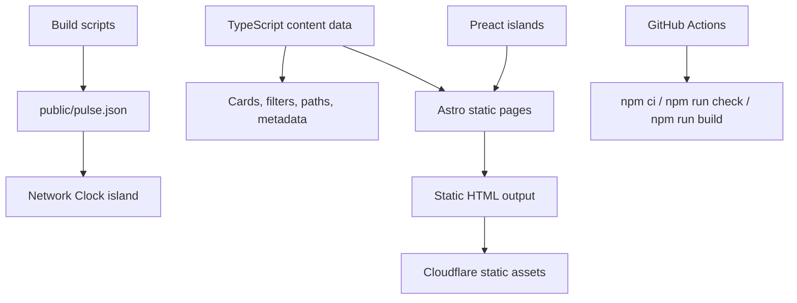

# BitcoinMind

## Overview

BitcoinMind is a static-first Bitcoin learning application for studying Bitcoin as money, protocol, custody practice, and sovereignty.

Live site: https://bitcoinmind.com

It is not a price site, trading dashboard, or generic crypto portal. The problem it solves is orientation: Bitcoin has too much noise around it, and serious readers often do not know where to begin, what to read next, or how monetary history, protocol design, self-custody, and sovereignty fit together.

BitcoinMind turns that study process into a structured product. It uses Astro for static routes, Preact islands for targeted interaction, TypeScript datasets for content modeling, build scripts for generated network snapshots, shared SEO infrastructure, GitHub Actions CI, and Cloudflare static deployment.

As a portfolio project, the important part is the path from prototype to product:

- an AI-generated single-file prototype became a maintainable Astro application
- hardcoded page content became structured data that powers multiple surfaces
- interactivity was added selectively instead of turning the site into a heavy SPA
- AI tools were used for architecture, copy, refactoring, UI polish, and debugging
- product judgment stayed human-led: scope, navigation, tone, hierarchy, and final acceptance

## Why This Exists

Bitcoin is usually explained through price, news, or ideology. BitcoinMind takes a narrower route: money before market price, protocol before narrative, verification before trust, custody before speculation.

The site is built for readers who want a serious path through the subject. It moves from the Bitcoin whitepaper and monetary history into primary texts, tools, objections, custody practice, and long-term frames for thinking about value.

The product is intentionally curated rather than exhaustive. The standard is not "more links"; it is better sequencing, clearer rationale, and fewer dead ends for the reader.

## Architecture



## Product Decisions

- Static first: content should load quickly, remain crawlable, and work without a custom application server.
- Structured data over duplication: resources live in TypeScript datasets that power pages, cards, filters, paths, counts, and metadata.
- Selective interactivity: Preact is used only where client-side behavior adds value, such as the Network Clock, Today's Pick, and interactive Frames.
- Curated over exhaustive: the site chooses a path through the subject instead of trying to cover every Bitcoin resource.
- AI as leverage: AI helped generate, migrate, refactor, and polish, but product direction, content standards, navigation choices, and final acceptance remained human-led.

## Product Surface

Core sections:

- Primer: a five-step entrance from the Bitcoin whitepaper to money, sovereignty, and the author's 2011 note
- Library: curated books and long-form resources organized by learning layer
- Texts: primary essays and foundational Bitcoin writings
- Toolkit: custody, node, wallet, and verification tools
- Paths: guided study routes through money, protocol, custody, philosophy, and economic context
- Frames: interactive conceptual views for understanding money and purchasing power
- Timeline: major Bitcoin events across protocol, market, institutional, and cultural history
- Glossary: compact conceptual anchors for important terms
- Objections: serious criticisms answered without pretending they are weak
- Stack: the author's approach to DCA, cold storage, verification, and inheritance
- Notes: personal writing, including the April 2011 Bitcoin note
- Questions: reader-style questions answered from the site's point of view
- About: the origin story and curation principles

The current curated dataset includes 13 library items, 16 primary texts, 18 toolkit items, 6 guided learning paths, 17 timeline events, 16 glossary entries, 7 objections, 6 questions, and 2 interactive frames.

## Key Features

### Curated Knowledge Architecture

Problem: Bitcoin resources are easy to collect and hard to sequence. A long list of links does not tell a reader what to read first or why it matters.

Decision: Build the site around learning progression instead of resource volume.

Implementation: TypeScript datasets model resources by role, difficulty, learning stage, tags, and conceptual purpose. The same data powers resource cards, guided paths, filters, homepage previews, counts, and metadata, so the product can grow without duplicating content across pages.

### Network Clock

Problem: Bitcoin is a live network, but a static learning site should not become fragile because several third-party APIs are called directly from the browser.

Decision: Generate a first-party static network snapshot and let the client read from that stable endpoint.

Implementation: Build scripts fetch block height, hash rate, mempool count, and node count where available, then write `public/pulse.json`. A Preact island reads that file and displays block height, time since genesis, halving estimate, difficulty epoch progress, mined supply progress, hash rate, and mempool count with fallbacks.

### Interactive Purchasing-Power Frame

Problem: Monetary arguments are easier to evaluate when the reader can inspect time, purchasing power, and volatility directly.

Decision: Build a conceptual chart, not a trading dashboard.

Implementation: A Preact/SVG island combines CPI data, Big Mac price anchors, Bitcoin price anchors, a live BTC quote fallback path, log-scale rendering, pointer inspection, event jumps, and accessible chart labels. The result stays educational rather than financial-advice oriented.

### Search and Filtering

Problem: The site has many resource types, but a heavy client-side app would be unnecessary for mostly static content.

Decision: Keep filtering lightweight and compatible with static HTML.

Implementation: Resource pages use structured data attributes and a shared browser filter controller for search, filter buttons, grouped visibility, and empty states. The pages stay simple HTML first, with behavior layered on top.

### SEO and Static Publishing

Problem: A content-heavy learning site needs clean metadata, canonical URLs, and reliable static output.

Decision: Centralize page shell, metadata, and publishing concerns.

Implementation: A shared Astro base layout provides canonical URLs, descriptions, Open Graph metadata, Twitter metadata, structured JSON-LD where useful, font preloading, sitemap integration, and Cloudflare-ready static output.

## Development Approach

BitcoinMind began as a personal idea and a Claude Design-generated single-file HTML prototype. That prototype was useful as a visual and conceptual seed, but it was not a maintainable application.

The project was then guided into an Astro architecture:

1. Preserve the useful product direction from the prototype.
2. Replace the one-file structure with routes, layouts, components, and typed datasets.
3. Turn static page fragments into reusable content data.
4. Add Preact only where interaction was worth the client-side cost.
5. Use AI to propose code, copy, refactors, layout fixes, and design alternatives.
6. Review, rewrite, reject, or narrow AI output until the product stayed coherent.

The main skill demonstrated here is not prompting AI to generate pages, but repeatedly converting AI output into a coherent, maintainable product.

AI accelerated the work. Human judgment decided what belonged: scope, tone, navigation, content hierarchy, layout rhythm, mobile behavior, factual restraint, and final acceptance. Many changes were intentionally small: navigation labels, footer rhythm, mobile overscroll, page header spacing, filter behavior, and SEO copy were refined until the site felt like one product instead of a set of generated sections.

## Engineering Notes

### Stack

- Astro 6
- Preact islands
- TypeScript
- CSS custom design system
- GitHub Actions
- Cloudflare Workers static assets via Wrangler

### Project Structure

```text
src/
  components/       Reusable Astro and Preact components
  data/             Curated content and chart datasets
  layouts/          Shared document shell and SEO layout
  lib/              Site metadata, helpers, generated block height
  pages/            Static routes
  scripts/          Browser interaction scripts
  styles/           Design tokens and global styles

scripts-build/      Data refresh and generated asset scripts
public/             Static files and generated pulse snapshot
.github/workflows/  CI pipeline
```

### Build-Time Data Refresh

`npm run refresh-data` updates generated data used by the site:

- latest block height fallback
- `public/pulse.json` network snapshot
- `public/grain.png` texture asset

The data refresh path is defensive. If a live source fails, scripts preserve cached or fallback values instead of breaking the site.

### Continuous Integration

GitHub Actions runs on pull requests and pushes to `main`:

```text
npm ci
npm run check
npm run build
```

## Running Locally

Install dependencies:

```bash
npm ci
```

Start development server:

```bash
npm run dev
```

Run validation:

```bash
npm run check
npm run build
```

Refresh generated data:

```bash
npm run refresh-data
```

Preview production build:

```bash
npm run preview
```

## Limitations

This is not yet a full AI application in the narrow LLM-engineering sense. It does not currently include:

- retrieval-augmented generation
- runtime model calls
- prompt/version tracking
- automated content evaluation
- citation-grounded AI answers
- user accounts or personalization

That is intentional for the current version. The site first establishes the content system and product point of view.

## Future Work

The strongest next step would be a small, citation-grounded AI feature that respects the site's curated nature.

Possible directions:

- Ask BitcoinMind
- Build My Path
- Explain This Term
- Objection Coach
- Reading Companion

Any AI feature should cite sources, admit uncertainty, and stay inside the site's knowledge boundary. The goal is not to bolt on a chatbot, but to extend the knowledge map without weakening trust.

## Author

BitcoinMind is built by Hiei.
